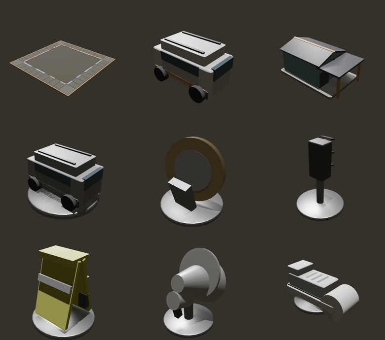

# Afromoly 3D assets

Every model here is built from primitives by a script, so the `.blend` files are
**outputs, not sources**. Edit `build_models.py` and re-run the export; do not
hand-edit a `.blend`, because the next build will overwrite it.

## Building

```bash
./export.sh                 # every asset
./export.sh token-coin      # just one
BLENDER=/path/to/blender ./export.sh
```

That writes `.blend` files here and `.glb` files into
`apps/web/public/models`, which is where the web client loads them from.

## Looking at them

```bash
./preview.sh                # renders previews/ and a contact sheet
```



Only the contact sheet is committed. The individual stills are reproducible and
are ignored by git.

## What gets built

| File | What it is |
| --- | --- |
| `board.glb` | The 40-space board: slab, ochre rim, raised tile pads, colour bands per corridor, and the centre well |
| `quantum-van.glb` | The development piece, a white high-roof Quantum |
| `terminal-depot.glb` | The upgrade: a pitched-roof hall with a loading canopy |
| `token-quantum.glb` | Toyota Quantum minibus |
| `token-coin.glb` | The bi-metallic R5, standing on edge |
| `token-robot.glb` | A traffic light, three hooded lenses on a post |
| `token-vest.glb` | A car guard's hi-vis vest, folded into an A-frame |
| `token-megaphone.glb` | The rank marshal's horn on a pedestal |
| `token-sneaker.glb` | A low-top canvas sneaker |
| `prop-robot.glb` | The impound lot's signal, lenses lit |
| `prop-bulb.glb` | City Power's bare bulb |
| `prop-tap.glb` | Joburg Water's standpipe tap |
| `prop-cards-kombi.glb`, `prop-cards-citywatch.glb` | Card stacks on the two deck spaces, top card in the deck's colour |
| `prop-coins.glb` | The rank pot on the Taxi Rank Queue |
| `prop-gantry.glb` | An e-toll gantry, cameras and all |
| `die.glb` | One die with inset pips; the client tumbles two of them |
| `diorama.glb` | The city around the board: Ponte, the Hillbrow Tower, mine dumps, the Mandela Bridge, Orlando Towers, a taxi rank, and jacarandas along the ring road. Built by `diorama.py` |

The ranks carry a small `quantum-van.glb` rather than a prop of their own.

## Keeping the board in step

`geometry.py` holds the tile layout: half-width, corner size, edge width and
depth. The web client repeats those numbers in
[`apps/web/lib/board3d.ts`](../../apps/web/lib/board3d.ts). **Change one and you
must change the other**, or tokens will stand beside their tiles rather than on
them. The web app's geometry tests will catch a tile leaving the board, but they
cannot see this file.

`palette.py` holds the colours, which match the client's night rank theme.
